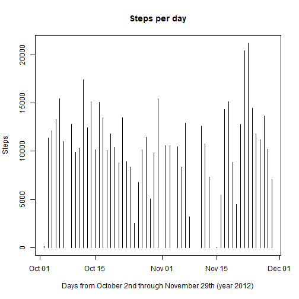
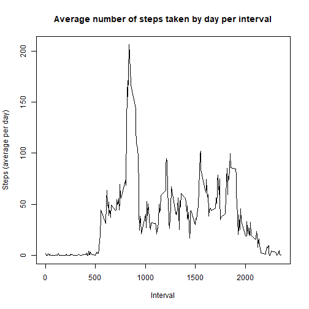
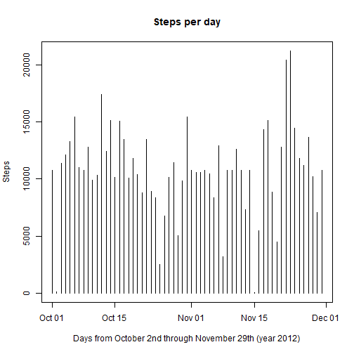
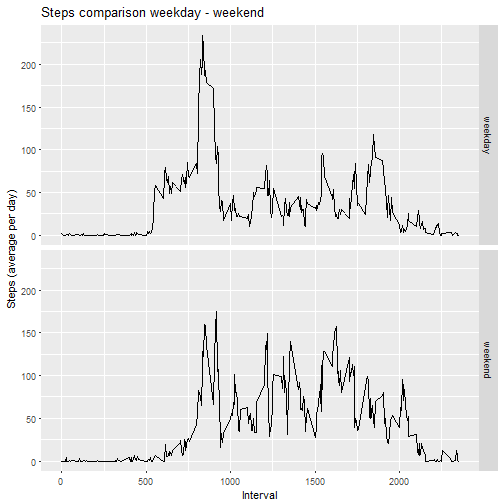

```r
knitr::opts_chunk$set(echo = TRUE)
```

## Loading and preprocessing the data

1. Load the data
2. Process/transform the data (if necessary) into a format suitable for your analysis


```r
setwd("C:/Users/juanp/Documents/JP/Reproducible_research")
activity <- read.csv("activity.csv")
library(data.table)
```

```
## data.table 1.10.4
```

```
##   The fastest way to learn (by data.table authors): https://www.datacamp.com/courses/data-analysis-the-data-table-way
```

```
##   Documentation: ?data.table, example(data.table) and browseVignettes("data.table")
```

```
##   Release notes, videos and slides: http://r-datatable.com
```

```r
activity_2 <- na.omit(activity)
activity_2$date <- as.Date(activity_2$date)
activity_3 <- data.table(activity_2)
```

## Number of steps taken per day

1. Histogram of the total number of steps taken each day
2. Mean and Median total number of steps taken per day


```r
library(ggplot2)
```

```
## 
## Attaching package: 'ggplot2'
```

```
## The following object is masked _by_ '.GlobalEnv':
## 
##     diamonds
```

```r
activity_4 <- activity_3[,sum(steps),by = date]
plot(activity_4$date, activity_4$V1, type = "h", main = "Steps per day", xlab = "Days from October 2nd through November 29th (year 2012)", ylab = "Steps")
```



```r
activity_4 <- activity_3[,sum(steps),by = date]
Meanperday <- activity_3[,mean(steps),by = date]
Medianperday <- activity_3[,median(steps),by = date]
```

The Mean values per day are presented below:


```r
Meanperday
```

```
##           date         V1
##  1: 2012-10-02  0.4375000
##  2: 2012-10-03 39.4166667
##  3: 2012-10-04 42.0694444
##  4: 2012-10-05 46.1597222
##  5: 2012-10-06 53.5416667
##  6: 2012-10-07 38.2465278
##  7: 2012-10-09 44.4826389
##  8: 2012-10-10 34.3750000
##  9: 2012-10-11 35.7777778
## 10: 2012-10-12 60.3541667
## 11: 2012-10-13 43.1458333
## 12: 2012-10-14 52.4236111
## 13: 2012-10-15 35.2048611
## 14: 2012-10-16 52.3750000
## 15: 2012-10-17 46.7083333
## 16: 2012-10-18 34.9166667
## 17: 2012-10-19 41.0729167
## 18: 2012-10-20 36.0937500
## 19: 2012-10-21 30.6284722
## 20: 2012-10-22 46.7361111
## 21: 2012-10-23 30.9652778
## 22: 2012-10-24 29.0104167
## 23: 2012-10-25  8.6527778
## 24: 2012-10-26 23.5347222
## 25: 2012-10-27 35.1354167
## 26: 2012-10-28 39.7847222
## 27: 2012-10-29 17.4236111
## 28: 2012-10-30 34.0937500
## 29: 2012-10-31 53.5208333
## 30: 2012-11-02 36.8055556
## 31: 2012-11-03 36.7048611
## 32: 2012-11-05 36.2465278
## 33: 2012-11-06 28.9375000
## 34: 2012-11-07 44.7326389
## 35: 2012-11-08 11.1770833
## 36: 2012-11-11 43.7777778
## 37: 2012-11-12 37.3784722
## 38: 2012-11-13 25.4722222
## 39: 2012-11-15  0.1423611
## 40: 2012-11-16 18.8923611
## 41: 2012-11-17 49.7881944
## 42: 2012-11-18 52.4652778
## 43: 2012-11-19 30.6979167
## 44: 2012-11-20 15.5277778
## 45: 2012-11-21 44.3993056
## 46: 2012-11-22 70.9270833
## 47: 2012-11-23 73.5902778
## 48: 2012-11-24 50.2708333
## 49: 2012-11-25 41.0902778
## 50: 2012-11-26 38.7569444
## 51: 2012-11-27 47.3819444
## 52: 2012-11-28 35.3576389
## 53: 2012-11-29 24.4687500
##           date         V1
```

The Median values per day are presented below:


```r
Medianperday
```

```
##           date V1
##  1: 2012-10-02  0
##  2: 2012-10-03  0
##  3: 2012-10-04  0
##  4: 2012-10-05  0
##  5: 2012-10-06  0
##  6: 2012-10-07  0
##  7: 2012-10-09  0
##  8: 2012-10-10  0
##  9: 2012-10-11  0
## 10: 2012-10-12  0
## 11: 2012-10-13  0
## 12: 2012-10-14  0
## 13: 2012-10-15  0
## 14: 2012-10-16  0
## 15: 2012-10-17  0
## 16: 2012-10-18  0
## 17: 2012-10-19  0
## 18: 2012-10-20  0
## 19: 2012-10-21  0
## 20: 2012-10-22  0
## 21: 2012-10-23  0
## 22: 2012-10-24  0
## 23: 2012-10-25  0
## 24: 2012-10-26  0
## 25: 2012-10-27  0
## 26: 2012-10-28  0
## 27: 2012-10-29  0
## 28: 2012-10-30  0
## 29: 2012-10-31  0
## 30: 2012-11-02  0
## 31: 2012-11-03  0
## 32: 2012-11-05  0
## 33: 2012-11-06  0
## 34: 2012-11-07  0
## 35: 2012-11-08  0
## 36: 2012-11-11  0
## 37: 2012-11-12  0
## 38: 2012-11-13  0
## 39: 2012-11-15  0
## 40: 2012-11-16  0
## 41: 2012-11-17  0
## 42: 2012-11-18  0
## 43: 2012-11-19  0
## 44: 2012-11-20  0
## 45: 2012-11-21  0
## 46: 2012-11-22  0
## 47: 2012-11-23  0
## 48: 2012-11-24  0
## 49: 2012-11-25  0
## 50: 2012-11-26  0
## 51: 2012-11-27  0
## 52: 2012-11-28  0
## 53: 2012-11-29  0
##           date V1
```

## Average daily activity pattern

1. Make a time series plot (i.e. type = "l") of the 5-minute interval (x-axis) and the average number of steps taken, averaged across all days (y-axis)
2. Which 5-minute interval, on average across all the days in the dataset, contains the maximum number of steps?


```r
activity_adap <- activity_3[,mean(steps),by = interval]
plot(activity_adap$interval, activity_adap$V1, type = "l", xlab = "Interval", ylab = "Steps (average per day)", main = "Average number of steps taken by day per interval")
```



```r
activity_adap[,max(V1)]
```

```
## [1] 206.1698
```

```r
maxsteps <- activity_adap[,max(V1)]
intervalmaxsteps <- activity_adap[(V1 == maxsteps),]
intervalmaxsteps
```

```
##    interval       V1
## 1:      835 206.1698
```

The interval 835 is the one that contains the maximum number of steps (206.1698113 steps).

## Imputing missing values

Note that there are a number of days/intervals where there are missing values (coded as NA). The presence of missing days may introduce bias into some calculations or summaries of the data.

1. Calculate and report the total number of missing values in the dataset (i.e. the total number of rows with NAs)
2. Devise a strategy for filling in all of the missing values in the dataset. The strategy does not need to be sophisticated. For example, you could use the mean/median for that day, or the mean for that 5-minute interval, etc.
3. Create a new dataset that is equal to the original dataset but with the missing data filled in.
4. Make a histogram of the total number of steps taken each day and Calculate and report the mean and median total number of steps taken per day. Do these values differ from the estimates from the first part of the assignment? What is the impact of imputing missing data on the estimates of the total daily number of steps?


```r
activity_nas <- is.na(activity)
nas_values <- sum(activity_nas==TRUE)
head(activity)
```

```
##   steps       date interval
## 1    NA 2012-10-01        0
## 2    NA 2012-10-01        5
## 3    NA 2012-10-01       10
## 4    NA 2012-10-01       15
## 5    NA 2012-10-01       20
## 6    NA 2012-10-01       25
```

```r
head(activity_adap)
```

```
##    interval        V1
## 1:        0 1.7169811
## 2:        5 0.3396226
## 3:       10 0.1320755
## 4:       15 0.1509434
## 5:       20 0.0754717
## 6:       25 2.0943396
```

The total number of NAs values is 2304.


```r
##The new dataset with the missigan data filled in is created with the below code:
interval_no_na <- activity
for (i in 1:nrow(interval_no_na)) {
  if(is.na(interval_no_na$steps[i]))
  {
    a <- which(interval_no_na$interval[i] == activity_adap$interval)
    interval <- activity_adap$V1[a]
    interval_no_na$steps[i] <- interval
  }
  else
    {
      ##This is just to visualize that the rows with a value in "steps" is again assigned to the same row
      interval_no_na$steps[i] <- interval_no_na$steps[i]
    }
}
```


```r
##activity_2 <- na.omit(activity)
interval_no_na$date <- as.Date(interval_no_na$date)
interval_no_na <- data.table(interval_no_na)

activity_imv <- interval_no_na[,sum(steps),by = date]
plot(activity_imv$date, activity_imv$V1, type = "h", main = "Steps per day", xlab = "Days from October 2nd through November 29th (year 2012)", ylab = "Steps")
```



```r
activity_imv <- interval_no_na[,sum(steps),by = date]
Meanperday_no_na <- interval_no_na[,mean(steps),by = date]
Medianperday_no_na <- interval_no_na[,median(steps),by = date]
```

The Mean values per day are presented below:


```r
Meanperday_no_na
```

```
##           date         V1
##  1: 2012-10-01 37.3825996
##  2: 2012-10-02  0.4375000
##  3: 2012-10-03 39.4166667
##  4: 2012-10-04 42.0694444
##  5: 2012-10-05 46.1597222
##  6: 2012-10-06 53.5416667
##  7: 2012-10-07 38.2465278
##  8: 2012-10-08 37.3825996
##  9: 2012-10-09 44.4826389
## 10: 2012-10-10 34.3750000
## 11: 2012-10-11 35.7777778
## 12: 2012-10-12 60.3541667
## 13: 2012-10-13 43.1458333
## 14: 2012-10-14 52.4236111
## 15: 2012-10-15 35.2048611
## 16: 2012-10-16 52.3750000
## 17: 2012-10-17 46.7083333
## 18: 2012-10-18 34.9166667
## 19: 2012-10-19 41.0729167
## 20: 2012-10-20 36.0937500
## 21: 2012-10-21 30.6284722
## 22: 2012-10-22 46.7361111
## 23: 2012-10-23 30.9652778
## 24: 2012-10-24 29.0104167
## 25: 2012-10-25  8.6527778
## 26: 2012-10-26 23.5347222
## 27: 2012-10-27 35.1354167
## 28: 2012-10-28 39.7847222
## 29: 2012-10-29 17.4236111
## 30: 2012-10-30 34.0937500
## 31: 2012-10-31 53.5208333
## 32: 2012-11-01 37.3825996
## 33: 2012-11-02 36.8055556
## 34: 2012-11-03 36.7048611
## 35: 2012-11-04 37.3825996
## 36: 2012-11-05 36.2465278
## 37: 2012-11-06 28.9375000
## 38: 2012-11-07 44.7326389
## 39: 2012-11-08 11.1770833
## 40: 2012-11-09 37.3825996
## 41: 2012-11-10 37.3825996
## 42: 2012-11-11 43.7777778
## 43: 2012-11-12 37.3784722
## 44: 2012-11-13 25.4722222
## 45: 2012-11-14 37.3825996
## 46: 2012-11-15  0.1423611
## 47: 2012-11-16 18.8923611
## 48: 2012-11-17 49.7881944
## 49: 2012-11-18 52.4652778
## 50: 2012-11-19 30.6979167
## 51: 2012-11-20 15.5277778
## 52: 2012-11-21 44.3993056
## 53: 2012-11-22 70.9270833
## 54: 2012-11-23 73.5902778
## 55: 2012-11-24 50.2708333
## 56: 2012-11-25 41.0902778
## 57: 2012-11-26 38.7569444
## 58: 2012-11-27 47.3819444
## 59: 2012-11-28 35.3576389
## 60: 2012-11-29 24.4687500
## 61: 2012-11-30 37.3825996
##           date         V1
```

The Median values per day are presented below:


```r
Medianperday_no_na
```

```
##           date       V1
##  1: 2012-10-01 34.11321
##  2: 2012-10-02  0.00000
##  3: 2012-10-03  0.00000
##  4: 2012-10-04  0.00000
##  5: 2012-10-05  0.00000
##  6: 2012-10-06  0.00000
##  7: 2012-10-07  0.00000
##  8: 2012-10-08 34.11321
##  9: 2012-10-09  0.00000
## 10: 2012-10-10  0.00000
## 11: 2012-10-11  0.00000
## 12: 2012-10-12  0.00000
## 13: 2012-10-13  0.00000
## 14: 2012-10-14  0.00000
## 15: 2012-10-15  0.00000
## 16: 2012-10-16  0.00000
## 17: 2012-10-17  0.00000
## 18: 2012-10-18  0.00000
## 19: 2012-10-19  0.00000
## 20: 2012-10-20  0.00000
## 21: 2012-10-21  0.00000
## 22: 2012-10-22  0.00000
## 23: 2012-10-23  0.00000
## 24: 2012-10-24  0.00000
## 25: 2012-10-25  0.00000
## 26: 2012-10-26  0.00000
## 27: 2012-10-27  0.00000
## 28: 2012-10-28  0.00000
## 29: 2012-10-29  0.00000
## 30: 2012-10-30  0.00000
## 31: 2012-10-31  0.00000
## 32: 2012-11-01 34.11321
## 33: 2012-11-02  0.00000
## 34: 2012-11-03  0.00000
## 35: 2012-11-04 34.11321
## 36: 2012-11-05  0.00000
## 37: 2012-11-06  0.00000
## 38: 2012-11-07  0.00000
## 39: 2012-11-08  0.00000
## 40: 2012-11-09 34.11321
## 41: 2012-11-10 34.11321
## 42: 2012-11-11  0.00000
## 43: 2012-11-12  0.00000
## 44: 2012-11-13  0.00000
## 45: 2012-11-14 34.11321
## 46: 2012-11-15  0.00000
## 47: 2012-11-16  0.00000
## 48: 2012-11-17  0.00000
## 49: 2012-11-18  0.00000
## 50: 2012-11-19  0.00000
## 51: 2012-11-20  0.00000
## 52: 2012-11-21  0.00000
## 53: 2012-11-22  0.00000
## 54: 2012-11-23  0.00000
## 55: 2012-11-24  0.00000
## 56: 2012-11-25  0.00000
## 57: 2012-11-26  0.00000
## 58: 2012-11-27  0.00000
## 59: 2012-11-28  0.00000
## 60: 2012-11-29  0.00000
## 61: 2012-11-30 34.11321
##           date       V1
```

After modifying the set, filling the NAs with values:

The Mean did not change for any day.
The Median changed for some days.


## Differences in patterns between weekdays and weekends

For this part the weekdays() function may be of some help here. Use the dataset with the filled-in missing values for this part.

1. Create a new factor variable in the dataset with two levels -- "weekday" and "weekend" indicating whether a given date is a weekday or weekend day.
2. Make a panel plot containing a time series plot (i.e. type = "l") of the 5-minute interval (x-axis) and the average number of steps taken, averaged across all weekday days or weekend days (y-axis). The plot should look something like the following, which was created using simulated data:


```r
activity_2$day <- weekdays(activity_2$date)
activity_2$weekdayweekend[activity_2$day %in% c("Monday","Tuesday","Wednesday","Thursday","Friday")] <- "weekday"
activity_2$weekdayweekend[activity_2$day %in% c("Saturday","Sunday")] <- "weekend"
```


```r
library(dplyr)
```

```
## 
## Attaching package: 'dplyr'
```

```
## The following objects are masked from 'package:data.table':
## 
##     between, first, last
```

```
## The following objects are masked from 'package:stats':
## 
##     filter, lag
```

```
## The following objects are masked from 'package:base':
## 
##     intersect, setdiff, setequal, union
```

```r
actweekdayweekend <- activity_2 %>%
    group_by(weekdayweekend, interval) %>%
    summarize(avgsteps=mean(steps))

qplot(interval, avgsteps, data = actweekdayweekend, type = "l", geom = "line", facets = weekdayweekend~., xlab = "Interval", ylab = "Steps (average per day)", main = "Steps comparison weekday - weekend")
```


